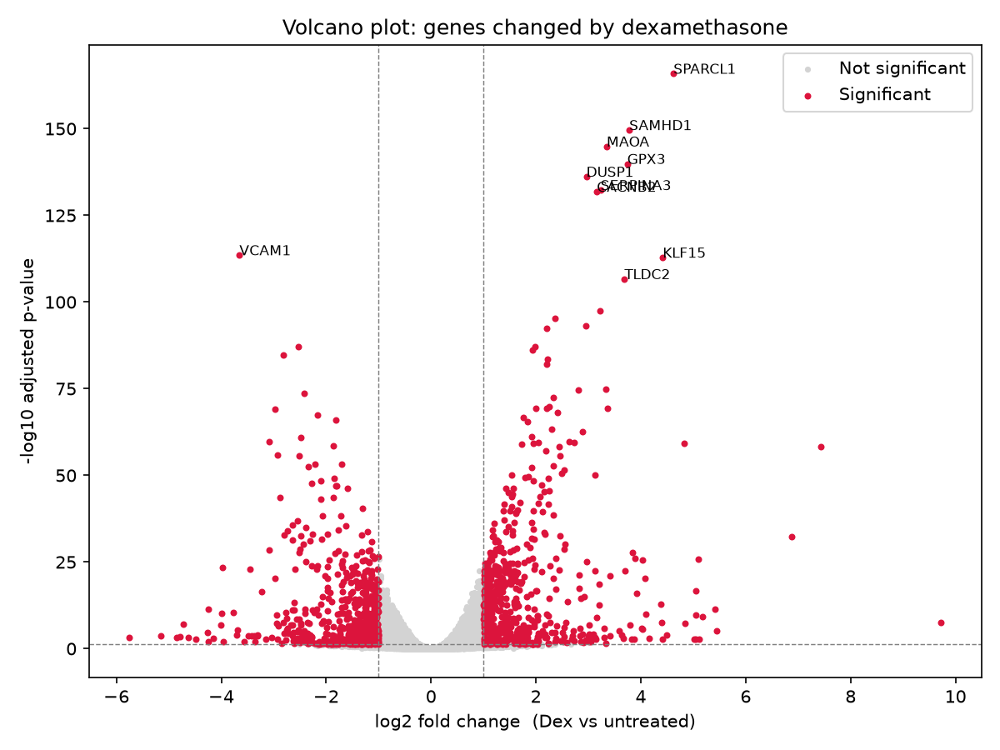
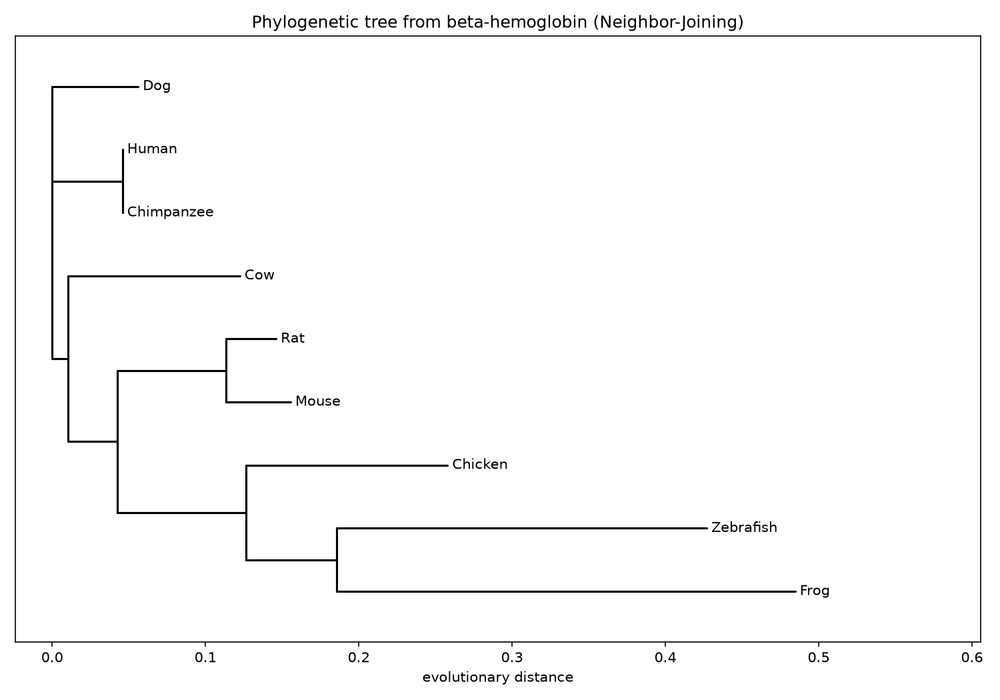
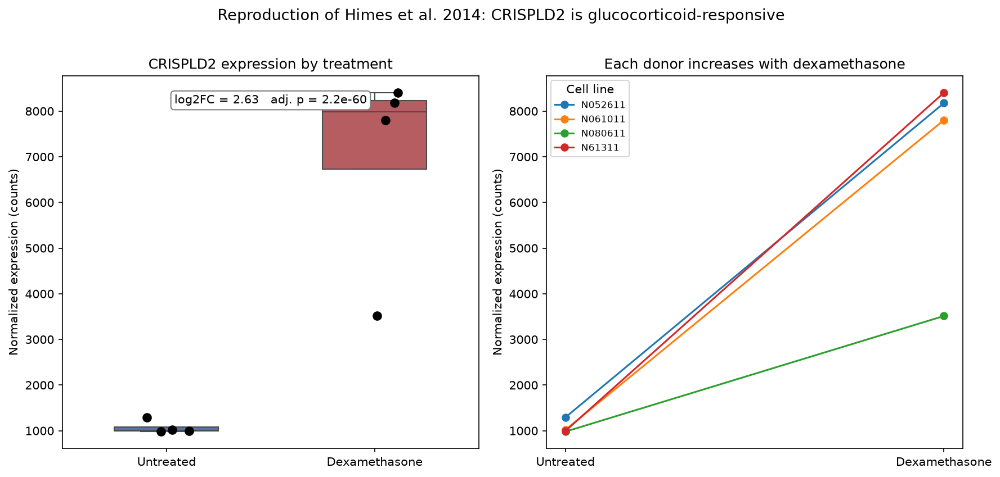
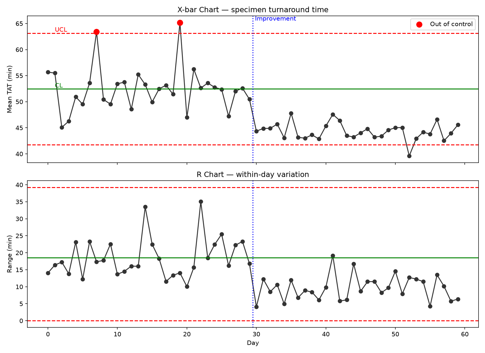

# Bioinformatics & Data Science Portfolio — Nurudeen Umar

Five end-to-end projects spanning genomics, data visualization, and quality
engineering — combining wet-lab domain knowledge with Python, R-style statistics,
and interactive analytics.

**Tech:** Python · pandas · DESeq2 (pydeseq2) · Biopython · matplotlib · seaborn · Tableau · Lean Six Sigma

---

## 1. Differential Gene Expression Analysis
Identified genes responding to an asthma steroid (dexamethasone) in human airway
cells from **NCBI GEO** RNA-seq data using **DESeq2**.
- **4,536** significantly differentially expressed genes; recovered known
  glucocorticoid-response genes (DUSP1, KLF15, SPARCL1).
- 📁 [`01-gene-expression/`](01-gene-expression/)

## 2. U.S. Public Health Analytics Dashboard
Cleaned a **110,000-row CDC dataset** with Python and built an interactive
**Tableau** dashboard of adult obesity by state, time, and demographics.
- Surfaced a clear income-based health disparity (~30% vs ~40% obesity).
- 🔗 **[Live dashboard on Tableau Public](https://public.tableau.com/app/profile/nurudeen.umar/viz/Book1_17857823139820/Dashboard1)**
- 📁 [`02-health-dashboard/`](02-health-dashboard/)

## 3. Sequence Analysis Pipeline (Phylogenetics)
Biopython pipeline that fetches beta-hemoglobin protein sequences for **9 species**
from **NCBI**, computes pairwise identity, and builds a phylogenetic tree.
- Correctly recovers vertebrate evolution (human–chimpanzee 100% identical).
- 📁 [`03-sequence-pipeline/`](03-sequence-pipeline/)

## 4. Published Figure Reproduction
Reproduced the central finding of **Himes et al. (2014, PLoS ONE)** from raw data,
confirming **CRISPLD2** is a glucocorticoid-responsive gene (up ~6.2×, adj. p < 10⁻⁵⁰).
- 📁 [`04-figure-reproduction/`](04-figure-reproduction/)

## 5. Lean Six Sigma DMAIC Case Study
Process-improvement case study on a clinical-lab QC process using Pareto, fishbone,
and **SPC control charts** — improved process capability (Cpk) from 0.31 to 1.28.
- 📁 [`05-six-sigma-spc/`](05-six-sigma-spc/)

---

*Each project folder contains its own README, runnable scripts, and results.*
